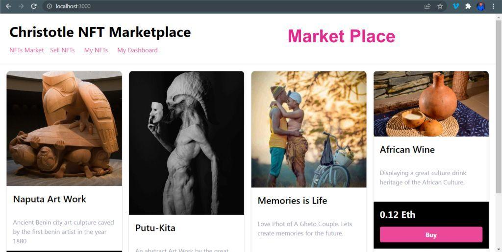
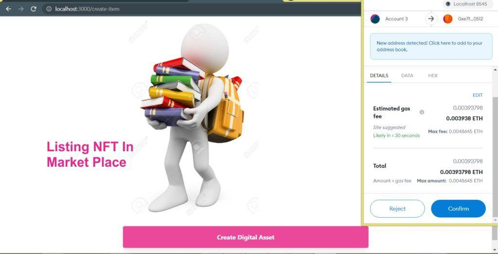

## Full stack NFT marketplace built with Polygon, Solidity, IPFS, Web3, Ether, Tailwind & Next.js  


This is a full stack project with both frontend and backend connected.

Helping you to see how things are put together and not just writing solidity,
or just interacting with a contract, etc but actually building the whole thing
and testing it end to end.

Another interesting thing about this project is that we will be working with an Ethereum 
Scalability Solution like Polygon which helps us achieve things with cheap transaction fees.

We will be working with:
1. Hardhat: for the solidity development environmrnt 
2. Ether: for client library to interact with chain
3. IPFS: for files uploads and files downloads
4. Web3 module: to enable us choose a wallet to work with...(Metamask etc)
5. Chai: for testing
6. OpenZeppelin/Contract: to inherit the ERC721 contract functionality. 
7. NextJS: for our frontend app.
7. Tailwing: to simplify our styling. 
9. Axios: for fetching data from library. 

### Screenshots





### Running this project
follow the steps bellow:

To run this project locally, follow these steps.

* Clone the project locally, change into the directory, and install the dependencies:

```sh
git clone https://github.com/johnchristotle/NFT-Marketplace-Project.git

cd NFT-Marketplace-Project

# install using NPM or Yarn
npm install

# or

yarn
```

### KEY NOTES:
1. look at the .gitignore file and find 3 key ignored files:
provide yours to enable you run this app e.g

a. .infuraId - get an ID from infura and place it here
b. .secret - copy the private key of the wallet you intend to use and place it here
c. config.js - when you run ```npx hardhat run scripts/deploy.js --network localhost/mumbai/mainnet``` the contract address will automatically appear there.


### Local setup

2. Start the local Hardhat node

```sh
npx hardhat node
```

3. With the network running, deploy the contracts to the local network in a separate terminal window

```sh
npx hardhat run scripts/deploy.js --network localhost
```

4. Start the app

```
npm run dev
```


### Testnet setup

2. Start the local Hardhat node

```sh
npx hardhat node
```

3. With the network running, deploy the contracts to the local network in a separate terminal window

```sh
npx hardhat run scripts/deploy.js --network mumbai
```

4. Start the app

```
npm run dev
```

### Mainnet setup

2. Start the local Hardhat node

```sh
npx hardhat node
```

3. With the network running, deploy the contracts to the local network in a separate terminal window

```sh
npx hardhat run scripts/deploy.js --network mainnet
```

4. Start the app

```
npm run dev
```